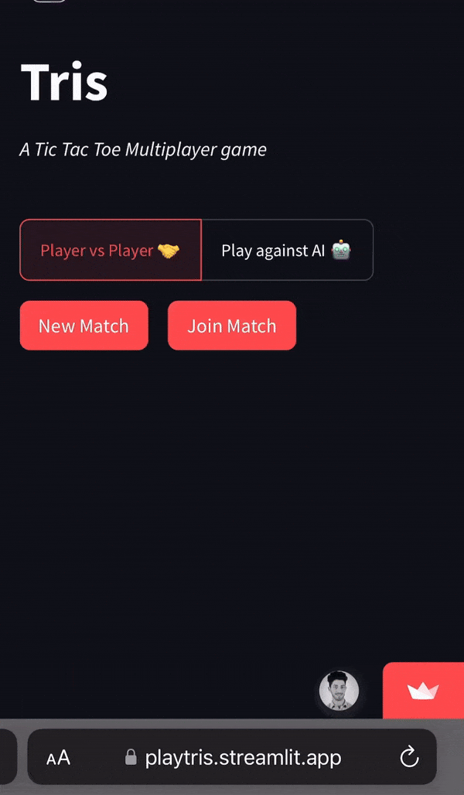

# Tris - First Multiplayer Game in Streamlit

<p align="center">
  
</p>

Tris is a multiplayer Tic Tac Toe game built with Streamlit. 

Why Tris? Because it's the Italian name for "Tic Tac Toe". 🇮🇹

## 🎮 Play Now

Try it out at [playtris.streamlit.app](https://playtris.streamlit.app)

## 🎯 About the Game

<p align="center">
  
</p>

Tris has a fascinating history: it was played in ancient Rome under the name "terni lapilli" by Roman soldiers. In 1952, it made computer science history as the first game ever played by a computer, through a program called OXO developed for the EDSAC computer.

The game is particularly interesting from a computer science perspective as it's:
- A perfect information game
- A zero-sum game
- Has a known "perfect strategy" (Nash equilibrium)
- Often used to teach game theory and AI basics


## ✨ Features

- **Multiplayer Mode**: Play with friends by sharing a unique match link
- **AI Player**: Test your skills against our AI
- **Easy Sharing**: Quick game sharing via WhatsApp
- **Modern UI**: Clean interface with responsive design

## 🛠️ Built With Pure Streamlit Magic

- Cache Resource and Session state for game management
- Dialogs for smooth interactions
- Custom CSS for that extra polish
- Latest released feature "segmented control" for game mode selection

## 🚀 Quick Start

1. Clone the repository
```bash
git clone https://github.com/fabiogra/tris.git
cd tris
```

2. Install dependencies
```bash
pip install -r requirements.txt
```

3. Run the app
```bash
streamlit run app/main.py
```

## 📝 How to Play

The game is played on a 3x3 grid. Players take turns marking empty cells with their symbol (traditionally X and O). The winner is the first player to get three of their symbols in a row - horizontally, vertically, or diagonally. If all cells are filled without a winner, the game is a draw (known as "patta" in Italian chess terminology).

1. Visit [playtris.streamlit.app](https://playtris.streamlit.app)
2. Choose your game mode (Multiplayer or AI)
3. For multiplayer:
   - Create a new match
   - Share the link with your friend
   - Start playing when they join!
4. For AI mode:
   - Toggle "Play against AI"
   - Create a new match
   - Play against our AI!


## 📄 License

This project is licensed under the MIT License - see the [LICENSE](LICENSE) file for details

